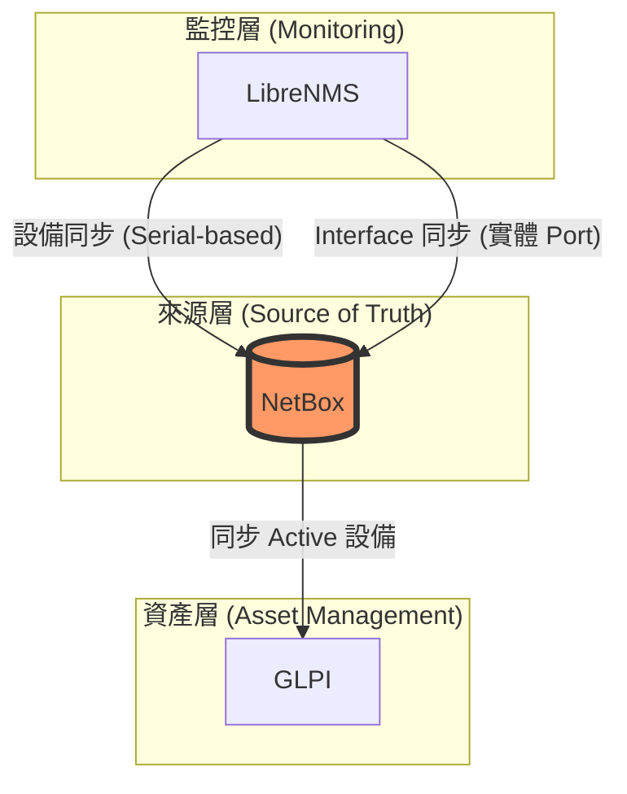

# IT Nexus: 企業級整合式資產管理系統 (v5.4)

IT Nexus 是一個高效、安全的 IT 基礎設施管理解決方案，整合了 **LibreNMS** (網路監控)、**NetBox** (真實來源 SoT) 與 **GLPI** (資產與財務管理)。

## 系統架構圖 (Architecture)



## 核心特色 (Core Features)

-   **單一真實來源 (SoT)**：以 NetBox 為中心，確保跨平台資料的一致性。
-   **多維同步**：
    -   設備資訊同步 (LibreNMS → NetBox → GLPI)
    -   **實體介面 (Interface) 同步**：僅同步有意義的 Port (Fa, Gi, Te, Po 等)。
    -   動態 Device Role 分類 (Server / Switch / Firewall / NAS / UPS)。
-   **Security Hardened**：
    -   強制 HTTPS 存取。
    -   API Token 分權與最小權限原則。
    -   Systemd 服務安全硬化 (NoNewPrivileges, Sandboxing)。
-   **資料治理**：
    -   **軟刪除 (Soft Delete)**：設備離線後標記為 `Decommissioned`，不直接刪除。
    -   **自動建立開關**：防止未經審核的資料污染 SoT。
-   **自動維運**：
    -   每日自動壓縮備份 (`pg_dump -Fc`)。
    -   同步指標 (`metrics_librenms.json` / `metrics_glpi.json`) 輸出。
    -   故障時 Email 即時通知。

## 快速開始 (Quick Start)

### 1. 部署 NetBox
```bash
sudo ./scripts/install_netbox_secure.sh
```

### 2. 配置環境變數
編輯 `/opt/netbox/scripts/.env` 並填入各平台 API Token。

### 3. 排程同步
```bash
# 啟用所有的定時器
sudo systemctl enable --now netbox-sync-librenms.timer netbox-sync-glpi.timer netbox-backup.timer
```

## 相關文件
- [專案指導原則 (Guidelines)](guidelines/README.md)
- [維運與排錯手冊](docs/MAINTENANCE.md)
- [實作計畫 (v5.4)](.agent/implementation_plan.md)
- [專案演練紀錄](.agent/walkthrough.md)

## 版本管理
本專案遵循語意化版本 (SemVer)：
- **v5.2**：Security Hardened Edition 基礎。
- **v5.3**：架構與運維優化版。
- **v5.4**：專業化、測試套件與模組化改進版。
