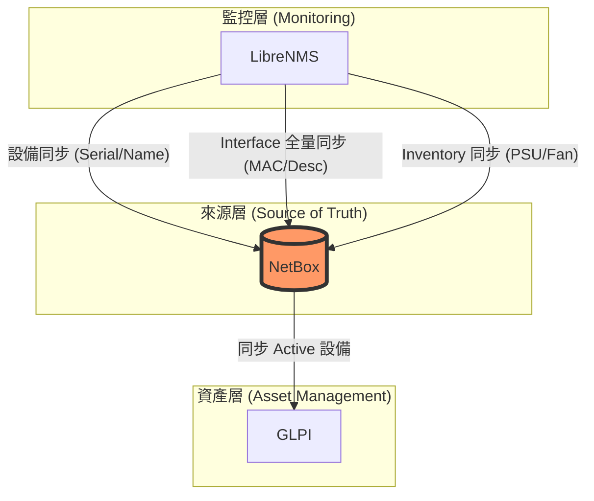

# IT Nexus: 企業級整合式資產管理系統 (v6.0)

IT Nexus 是一個高效、安全的 IT 基礎設施管理解決方案，整合了 **LibreNMS** (網路監控)、**NetBox** (真實來源 SoT) 與 **GLPI** (資產與財務管理)。

## 系統架構圖 (Architecture)


```mermaid
graph TD
    subgraph "監控層 (Monitoring)"
        L[LibreNMS]
    end

    subgraph "來源層 (Source of Truth)"
        N[(NetBox)]
    end

    subgraph "資產層 (Asset Management)"
        G[GLPI]
    end

    L -- "設備同步 (Serial/Name)" --> N
    L -- "Interface 全量同步 (MAC/Desc)" --> N
    L -- "Inventory 同步 (PSU/Fan)" --> N
    N -- "同步 Active 設備" --> G

    style N fill:#f96,stroke:#333,stroke-width:4px
```

## 核心特色 (Core Features)

-   **單一真實來源 (SoT)**：以 NetBox 為中心，確保跨平台資料的一致性。
-   **多維同步 (v6.0)**：
    -   **全面設備同步**：LibreNMS → NetBox (Site, Role, Platform, Serial)。
    -   **實體介面 (Interface) 全量同步**：同步所有實體 Port、MAC Address 與 Description。
    -   **組件清單 (Inventory) 同步**：同步電源供應器 (PSU)、風扇與模組。
    -   **IP 繫結同步**：將所有 IP 地址綁定至正確的 Interface。
-   **即時性與自動化**：
    -   **Webhook 即時觸發**：LibreNMS 異動即時推播至 NetBox。
    -   **Systemd Timer**：每 15 分鐘執行一次完整一致性檢查。
-   **Security Hardened**：
    -   強化的 API Token 最小權限管理。
    -   時區校準 (`Asia/Taipei`)。

## 快速開始 (Quick Start)

### 1. 部署 NetBox
```bash
sudo ./scripts/install_netbox_secure.sh
```

### 2. 配置環境變數
編輯 `/opt/netbox/scripts/.env` 並填入各平台 API Token。

### 3. 排程同步
```bash
# 啟用所有的定時器
sudo systemctl enable --now netbox-sync-librenms.timer netbox-sync-glpi.timer netbox-backup.timer
```

## 相關文件
- [專案指導原則 (Guidelines)](guidelines/README.md)
- [維運與排錯手冊](docs/MAINTENANCE.md)
- [實作計畫 (v6.0)](.agent/implementation_plan.md)
- [專案演練紀錄](.agent/walkthrough.md)

## 版本管理
本專案遵循語意化版本 (SemVer)：
- **v5.4**：專業化、測試套件與模組化改進版。
- **v5.6**：Platform 限制修正與自動化強化。
- **v6.0**：**全面資料同步 (Comprehensive Sync)**
    - 引入 Site, Interface, Inventory, All-IP 同步。
    - 實作 Webhook 即時觸發補丁。
    - 全系統時區校準。
